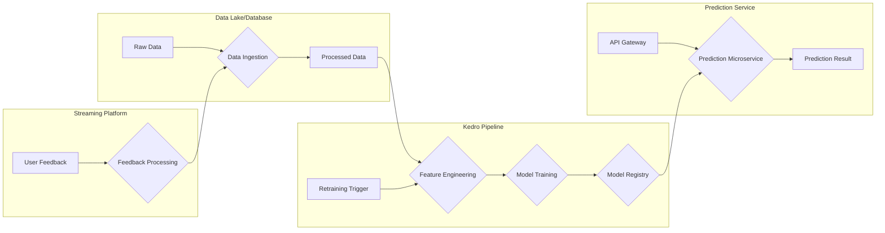

# Adapting the Solution for Real-Time Predictions and Continuous Improvement

While Kedro excels in building batch-oriented data pipelines, we can adapt it for real-time processing and continuous improvement by integrating additional technologies and architectural patterns.

# Proposed Approach
Key Concepts:
- Event Triggers: Leverage event triggers to initiate specific pipeline segments or nodes based on real-time events.
- Microservices: Extract certain nodes as independent microservices, particularly for prediction tasks requiring low latency responses.
- Streaming Data Processing: Integrate streaming data processing frameworks for handling continuous data flows and user feedback.

# Implementation Details
1. Event-Driven Triggers
- Technology: Consider using cloud functions (e.g., AWS Lambda) or lightweight event routers to detect events and trigger Kedro pipelines or specific nodes.
- Events: Define events for:
    - New data file arrival (triggers data ingestion nodes)
    - Prediction request (invokes prediction microservice)
    - User feedback (triggers feedback processing and potential retraining)
- Triggering Mechanisms:
    - Cloud storage events: When a new data file is uploaded to cloud storage, trigger the data ingestion nodes.
    - API Gateway events: Prediction requests through an API gateway can directly invoke the prediction microservice.
    - Message queue events: User feedback can be sent to a message queue and trigger the feedback processing pipeline segment.

2. Prediction Microservice
- Technology: Build a separate microservice using Flask, FastAPI, or similar frameworks for serving the model and handling prediction requests.
- Model Loading: Load the trained model from a central model registry or storage location.
- API Endpoints: Define API endpoints for receiving prediction requests and returning results.
- Deployment: Containerize the microservice with Docker and deploy it on a platform like Kubernetes for scalability and fault tolerance.

3. Streaming Data Processing
- Technology: Integrate Spark or Kafka Streams to handle continuous data flows and user feedback.
- Stream Processing Pipeline:
  - Consume data streams from sources like message queues or real-time databases.
  - Process user feedback and calculate relevant metrics.
  - Trigger retraining pipelines or update model parameters based on feedback and performance metrics.
- Kedro Integration:
  - Develop Kedro nodes that interact with the streaming platform to:
    - Send events or data to the stream.
    - Retrieve processed feedback and metrics from the stream.
    - Trigger retraining pipelines within Kedro based on the streaming data.

# Advantages
- Real-time capabilities: Enables near-instantaneous predictions and continuous data processing.
- Modular and scalable: Microservices architecture and event-driven triggers promote scalability and maintainability.
- Leverages Kedro strengths: Retains Kedro's benefits for batch processing and pipeline management.

# Challenges
- Increased complexity: Introducing additional technologies adds complexity to the architecture and requires expertise in streaming data processing and microservices.
- Integration effort: Integrating Kedro with streaming platforms and microservices necessitates careful design and implementation.
- Monitoring and orchestration: Comprehensive monitoring and orchestration are needed to ensure smooth operation and data consistency across components.

# Example Implementation
1. Data Ingestion:
- A new data file lands in cloud storage.
- A cloud function is triggered and invokes the Kedro data ingestion nodes.
- Processed data is stored in a data lake or database.
2. Prediction:
- A prediction request arrives through an API Gateway event.
- The prediction microservice is invoked, loads the relevant model, and performs the prediction.
- The result is returned through the API.
3. Feedback and Retraining:
- User feedback is sent to a message queue.
- A streaming pipeline consumes the feedback and calculates metrics.
- If retraining criteria are met, a Kedro retraining pipeline is triggered.
- The updated model is deployed to the prediction microservice.